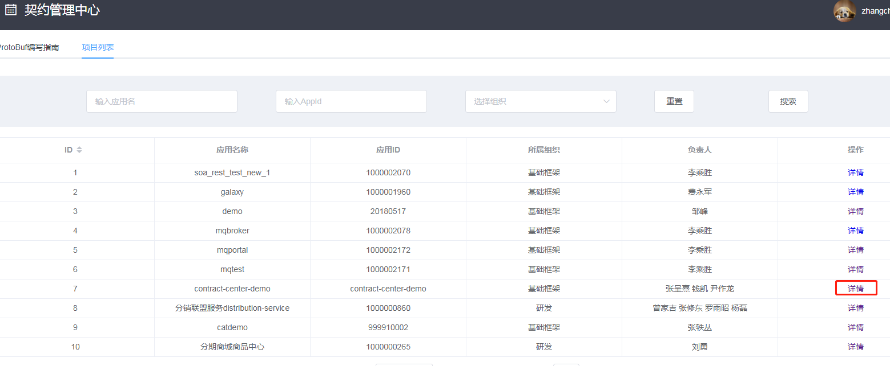
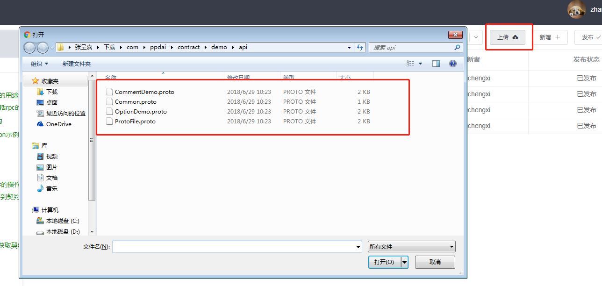
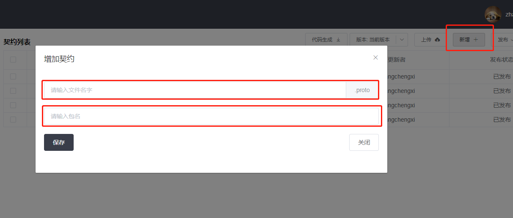
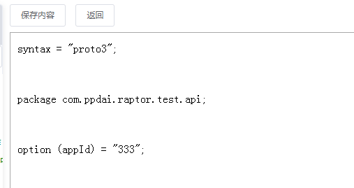
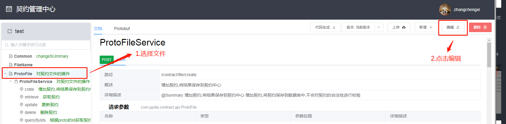
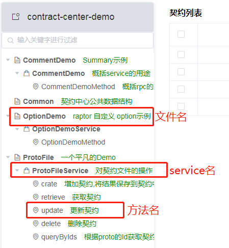
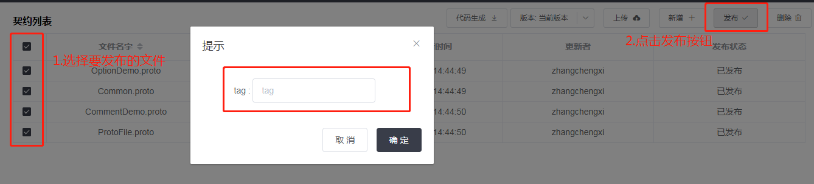

## 契约中心使用文档
本篇文档用于说明契约中心的基本用能,如果您在使用中有任何建议或意见,或者发现任何bug,欢迎联系**张呈熹**.

### 添加契约
契约是契约中心的最主要的部分.本节介绍如何添加契约.契约的编写可以参考[ProtoBuf 编写指南](todolink)
#### 准备工作
在添加契约之前,用户首先需要一个自己可以编辑的应用.应用可以找**钱凯**或者**张呈熹**申请.

申请时需要提供以下信息:
* 名字
* 应用ID
* 应用类型: (以下是选项)
  - IIS
  - Tomcat
  - Django
  - SpringBoot
* 应用级别:
  - 一般业务
  - 重要业务
  - 核心业务
* 所属组织:
  - 研发
  - 移动开发
  - 运维
  - 实时数据
  - 基础框架
* 环境Url -- 与kong网关相关,有需要的可以提供
* 服务类型:
  - 服务提供
  - 服务消费
  - Job
  - 其他
* 负责人 -- 请提供负责人的域账号名,只有负责人能编辑该应用对应契约
* 描述 -- 描述这个应用

应用申请好之后,在首页[项目列表]中找到我们的项目,进入项目主页.

#### 上传契约
进入项目主页之后我们可以看到契约列表页面.在契约列表页面的右上方有[上传]按钮.

点击上传按钮,我们可以一次性上传多个事先编写好的proto文档.

#### 在页面上添加契约
除了上传契约,我们可以在页面上添加契约. 
点击新增按钮,填写文件名和包名,点击确定,生成proto文档并跳转到编辑页.

自动生成的proto文档会包含包名和appId.

#### 编辑契约
在新增契约之后会跳转到编辑页面,也可以通过左边导航栏进入文档页面,然后点击右上角的编辑按钮进入对应契约的编辑页面.

### 查看契约

#### 在线查看
点击左边的导航栏可以进入对应契约的文档/protobuf页面.
  导航栏是一个树形结构,分为三层:
* 第一层: Protobuf文件名
* 第二层: Service名
* 第三层: rpc方法名

点击导航栏可以跳转到起对应的文档或者契约内容页面.
通过切换标签页查看文档或契约内容.

#### 下载契约
通过点击右上角的代码生成按钮来下载契约.下载的类型有4种:
1.  客户端: 带有pom文件和Proto文件的工程.
2.  服务端: 同上,现在提供的服务端和客户端提供的内容一模一样.
3.  Proto文件: 只包含proto文件
4.  Swagger文件: 通过编译Proto文件产生的Swagger文件

### 版本控制

#### 发布契约
只有发布之后的契约才能被不是管理员的用户查看. 只有通过编译的契约才能成功发布.
在契约列表选择需要发布的契约,然后点击右上角的发布按钮就能发布契约.发布契约的时候可以给这次发打上一个tag.

#### 切换版本
在右上角有一个版本按钮,点击按钮右边可以快速切换查看契约的版本,点击按钮左边进入版本列表.

#### 回退版本
回退功能可以将历史版本的内容override到"当前版本"(也就是草稿版本)中.
